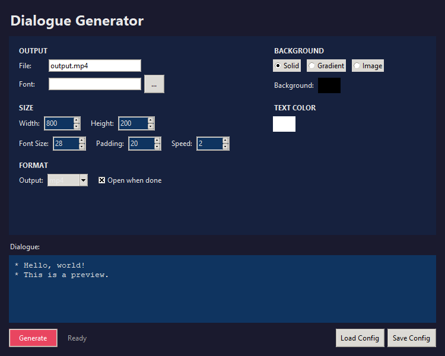

# Dialogue Generator

Generate Undertale/Deltarune-style dialogue videos with typing animation.



## Features

- Typing animation with punctuation pauses
- Solid color, gradient, or image backgrounds
- Export to MP4, WebM, or GIF
- GUI, TUI, and CLI interfaces

## Installation

```bash
pip install -r requirements.txt
```

Requires Python 3.8-3.12 (pygame doesn't support 3.14 yet).

## Usage

### GUI

```bash
python gui.py
```

Type dialogue directly, choose background type, and generate.

### TUI

```bash
python tui.py
```

Interactive terminal interface with the same features.

### CLI

```bash
# Solid background
python generate.py -i dialogue.txt -o output.mp4

# Gradient background
python gradient.py -i dialogue.txt --gradient vertical --format webm
```

## CLI Options

### generate.py

```
-i, --input       Input text file
-o, --output      Output video file
--font-size       Font size (default: 20)
--max-width       Max width (default: 1000)
--char-speed      Frames per char (default: 1)
--text-color      R,G,B
--bg-color        R,G,B
--gif-only        Export GIF only
--auto-open       Open when done
```

### gradient.py

```
-i, --input       Input text file
--width           Box width
--height          Box height
--gradient        vertical, horizontal, or none
--top-color       R,G,B,A
--bottom-color    R,G,B,A
--bg-image        Background image
--format          mp4, webm, or gif
--auto-open       Open when done
```

## License

Public domain.
