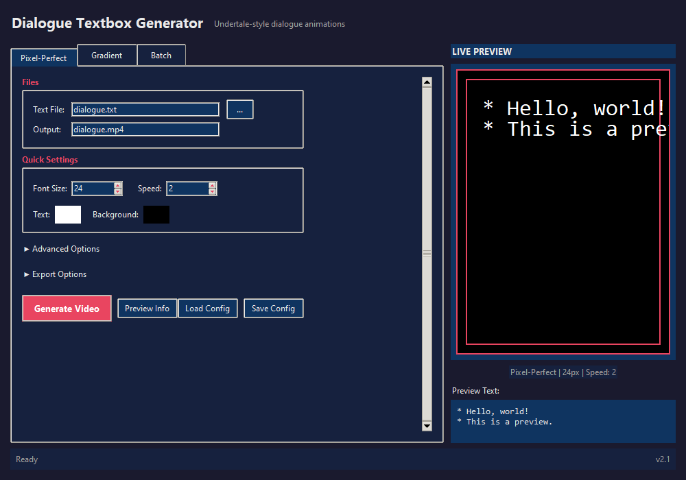
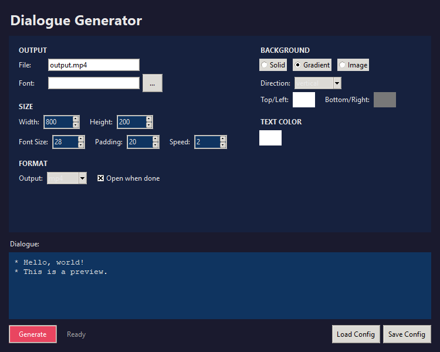
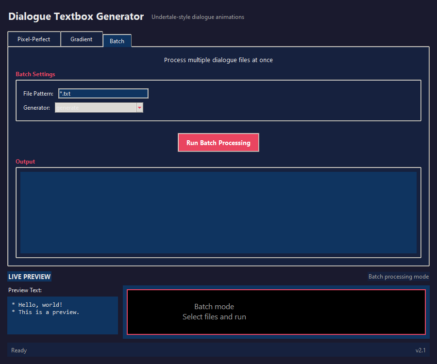

# Dialogue Textbox Generator

Generate pixel-perfect dialogue videos with typing animation, like Undertale/Deltarune.



## Features

- Pixel-perfect text rendering (no anti-aliasing)
- Gradient backgrounds (vertical/horizontal) or custom images
- Character-by-character typing animation with punctuation pauses
- Optional typing sound effects
- Export to MP4, WebM, or GIF
- GUI, TUI, and CLI interfaces
- Save/load settings as JSON
- Batch processing

## Installation

```bash
pip install pygame opencv-python numpy

# Optional
pip install tqdm      # Progress bars
pip install Pillow    # GIF export
pip install rich      # TUI interface
```

## Quick Start

### GUI (Recommended)

```bash
python gui.py
```



### CLI

```bash
# Pixel-perfect mode
python generate.py -i dialogue.txt -o output.mp4 --font-size 24

# Gradient mode
python gradient.py --format webm --gradient vertical
```

### TUI

```bash
python tui.py
```

## GUI Overview

The GUI has three modes:

| Mode | Description |
|------|-------------|
| **Pixel-Perfect** | Classic Undertale-style with solid background |
| **Gradient** | Modern look with gradient or image backgrounds |
| **Batch** | Process multiple dialogue files at once |



**Quick Settings** are always visible. **Advanced Options** and **Export Options** are collapsed by default - click to expand.

## CLI Reference

### generate.py

```
-i, --input FILE      Input text file (default: dialogue.txt)
-o, --output FILE     Output video file
-f, --font FILE       Font file path
-p, --portrait FILE   Portrait image
--font-size N         Font size (default: 20)
--max-width N         Max text width (default: 1000)
--char-speed N        Frames per character (default: 1)
--text-color R,G,B    Text color (default: 255,255,255)
--bg-color R,G,B      Background color (default: 0,0,0)
--gif                 Also export GIF
--auto-open           Open when done
--dry-run             Preview without rendering
--batch PATTERN       Process multiple files
```

### gradient.py

```
-i, --input FILE         Input text file
-o, --output NAME        Output filename
--width N                Box width (default: 1000)
--height N               Box height (default: 209)
--gradient TYPE          vertical, horizontal, or none
--top-color R,G,B,A      Top/left gradient color
--bottom-color R,G,B,A   Bottom/right gradient color
--text-color R,G,B,A     Text color
--bg-image FILE          Background image (overrides gradient)
--format FORMAT          webm, mp4, or gif
```

## Config Files

Save your settings:

```bash
python generate.py --init-config    # Creates config.json
python gradient.py --init-config    # Creates gradient_config.json
```

## Examples

```bash
# Green text on dark background
python generate.py --text-color 0,255,0 --bg-color 20,20,40

# Horizontal gradient with GIF output
python gradient.py --gradient horizontal --format gif

# Batch process all .txt files
python generate.py --batch "*.txt"
```

## Requirements

- Python 3.8+
- pygame, opencv-python, numpy
- Font file (.ttf/.otf) in current directory
- ffmpeg (optional, for WebM export)

## License

Public domain.
